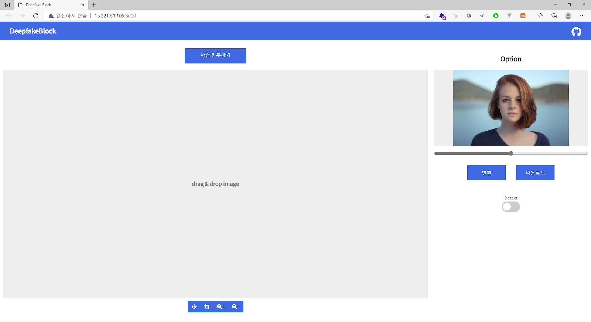
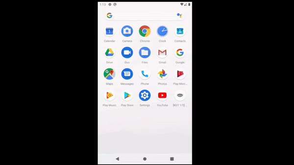

-silver.svg)

## Contents

1. [프로젝트 개요](#프로젝트 개요)
3. [사용 주요 개념](#사용 주요 개념)
4. [프로젝트 목표](#프로젝트 목표)
5. [사용 가이드](#사용 가이드)
5. [참고 자료](#참고 자료)

## 프로젝트 개요

머신러닝 기술이 발전함에 따라 수 많은 이점도 있지만, 그에 못지 않은 악용 사례들도 늘어나고 있다. 그 중 가장 대표적인 사례중 하나가 무분별하게 만들어지는 딥페이크 영상이다. 머신러닝 오픈소스 들이 널리 보편화 되면서 머신러닝에 지식이 많지 않은 사람들도 쉽게 딥페이크 영상을 만들 수 있는데 이를 막을 뚜렷한 방법은 아직 개발되지 않고 있다. 
우리는 Adversarial Attack 기술을 이용하여 육안으로는 거의 차이가 없지만 딥페이크로부터 보호 할 수 있도록 사진을 변환하는 웹 어플리케이션을 고안하였다. 머신러닝을 전혀 모르더라도 쉽게 접근하여 내가 원하는 사진을 딥페이크와 같은 머신러닝 악용으로부터 보호하는 기능을 사용자들에 제공하는 것이 이 프로젝트의 목표이다.

| Before                                                       | After                                                        |
| ------------------------------------------------------------ | ------------------------------------------------------------ |
|  |  |

영상을 보호하기 전과 후의 딥페이크 영상의 결과

## 사용 주요 개념 

이미지의 feature에는 사람의 눈으로 확인 가능한 robust feature와 사람의 눈으로는 확인하기 힘든 non-robust feature가 있는데 머신러닝 모델은 이 두가지 feature에 대한 구분을 잘 하지 못한다고 알려져 있다. 
사람의 눈으로 식별이 힘든 non-robust feature에만 변화를 줘서 사람은 차이를 별로 느끼지 못하지만 머신러닝 모델은 큰 차이를 느끼게 만들어서 좋지 않은 결과를 만들도록 하는 Adversarial attack의 개념을 이용하여 딥페이크 모델이 좋지 않은 결과를 만들도록 한다.

## 프로젝트 목표

딥페이크와 같은 머신러닝 악용으로부터 나의 사진을 보호하는 기능을 머신러닝을 모르는 사용자들도 접근하기 쉽게 만들어서 제공하는 것이 목표이다. 
우리의 프로젝트는 다음과 같은 기능을 구현하는 것을 목표로 하고있다.

1.	사진을 업로드했을 때 원본사진과 육안으로는 거의 차이가 없는 보호된 사진을 다운로드 할 수 있도록 하는 기능.
2.	결과 사진을 보고 보안을 적용할 정도를 조절할수 있도록 조절 기능.
3.	현재 널리 사용되는 딥페이크 모델에 직접 적용해서 얼마나 효과가 있는지 영상으로 시각화 해주는 기능.
4.	사용자가 추가로 편의에 따라 사용할 수 있는 이미지 필터 기능.

## 사용 가이드

### API Guide

API Guide는 [해당 문서](./API_Guide.md)를 참고

### Web Guide

http://18.221.61.105:8000 (현재 서비스 종료)

### App Guide

https://play.google.com/store/apps/details?id=com.KGT_AI_2.Cheonlian

## 참고 자료

- Xingxing Wei, Siyuan Liang, Ning Chen, Xiaochun Cao (2019) Transferable Adversarial Attacks for Image and Video Object Detection (https://arxiv.org/abs/1811.12641)
- Amin Ghiasi, Ali Shafahi, Tom Goldstein (2019) BREAKING CERTIFIED DEFENSES: SEMANTIC ADVERSARIAL EXAMPLES WITH SPOOFED ROBUSTNESS CERTIFICATES (https://openreview.net/pdf?id=HJxdTxHYvB)
- https://github.com/git-disl/TOG
- https://github.com/deepfakes/faceswap

